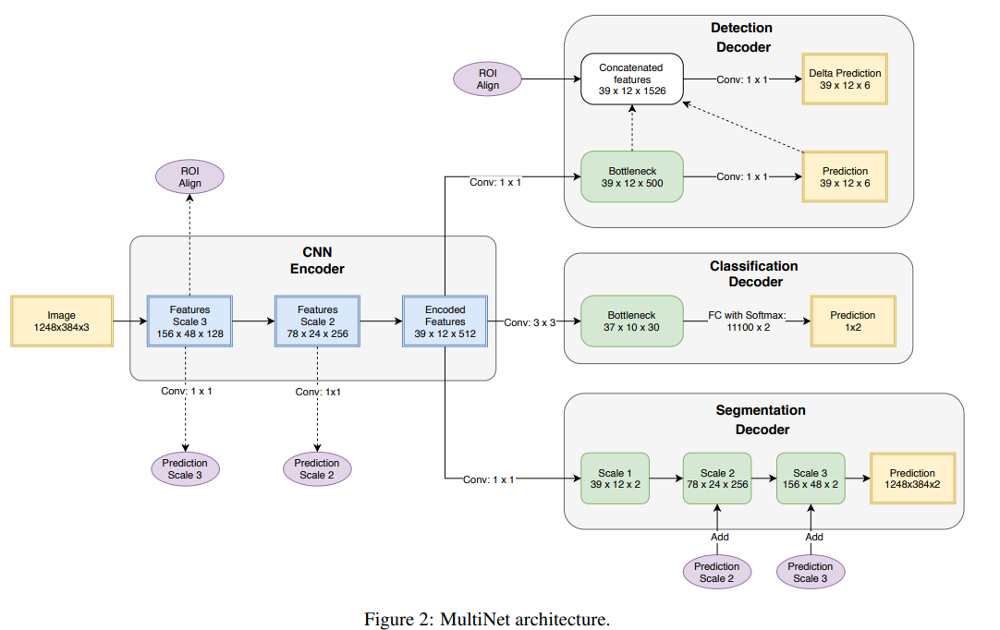
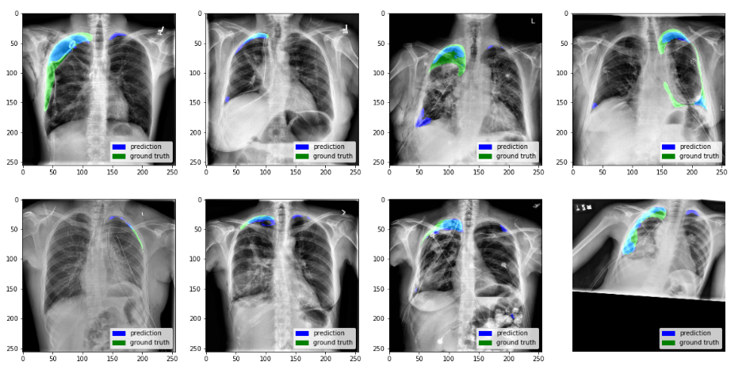
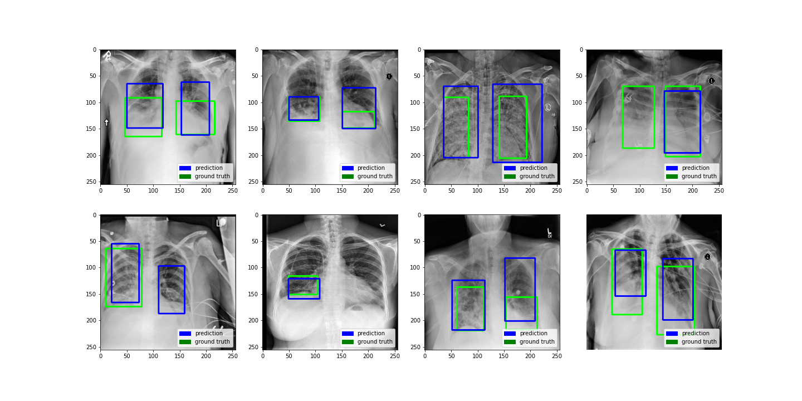
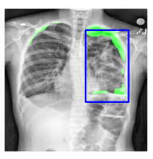

# MultiCheXNet (PyTorch)

A clean PyTorch reimplementation of **MultiCheXNet** — a single DenseNet-121 encoder shared by three task heads that run in **one forward pass**:

| Head | Task | Trained on | Output |
|---|---|---|---|
| **Classifier** | 3-class classification | derived from the two datasets below | normal / pneumothorax / pneumonia |
| **Detector** | object detection (Tiny-YOLOv2 style) | RSNA Pneumonia Detection Challenge | bounding boxes around pneumonia opacities |
| **Segmenter** | binary segmentation (Tiramisu-style decoder w/ skip connections) | SIIM-ACR Pneumothorax Segmentation | pixel mask of the pneumothorax region |

This is a from-scratch PyTorch port of the original Keras/TensorFlow [MultiCheXNet](https://github.com/coursat-ai/MultiCheXNet) project, based on the [MultiNet architecture](https://arxiv.org/pdf/1612.07695.pdf) applied to chest X-rays. The model architecture, loss functions, and training scheme (alternating-batch joint training) are faithfully translated, but the code is reorganized into a small, readable package instead of the original scattered scripts.

> **Scope note:** the original repo also contained an experimental "report generation" head (an LSTM captioning model on the Indiana University chest X-ray dataset). That's a separate NLP subsystem and is intentionally left out here to keep the project focused and easy to run end-to-end on a single Colab/Kaggle T4 GPU. Open an issue if you'd like it added back in.

---

## Table of contents

- [Architecture](#architecture)
- [Example results](#example-results)
- [Project structure](#project-structure)
- [Quick start](#quick-start-colab--kaggle-t4-gpu)
- [Datasets](#datasets)
- [Key implementation notes](#key-implementation-notes-vs-the-original-keras-code)
- [Extending this project](#extending-this-project)
- [License](#license)

---

## Architecture

All three heads share the same DenseNet-121 encoder, so a single forward pass produces all three outputs. Beyond the speed-up of not running three separate models, joint training (per the original paper) also acts as a form of multi-task regularization that improves each individual task.

```
                         ┌──────────────────────┐
   256x256x3 image ───▶  │  DenseNet-121 encoder │ ───▶ 8x8x1024 features
                         └──────────┬───────────┘
             (skip connections at 64x64, 32x32, 16x16 for the decoder)
                                     │
        ┌────────────────┬──────────┴──────────┬────────────────┐
        ▼                ▼                     ▼
 ClassifierHead     DetectorHead          SegmenterHead
 GAP→FC→FC→3        Conv→Conv→YOLO grid   Decoder + skip connections → 256x256 mask
 (softmax)          (8x8x5 anchors x 6)   (sigmoid)
```



*Figure: the general MultiNet architecture (Teichmann et al.) that this project's encoder/decoder layout is based on.*

---

## Example results

**Segmentation head** — predicted pneumothorax mask (blue) vs. ground truth (green):



**Detection head** — predicted bounding boxes (blue) vs. ground truth (green):



**Detection head — single example, close-up:**



---

## Project structure

```
MultiCheXNet_pytorch/
├── requirements.txt
├── README.md                      <- you are here
├── docs/
│   └── images/                    # README assets (architecture + prediction figures)
├── src/                            # the actual PyTorch package
│   ├── config.py                  # all shared constants (img size, anchors, class names...)
│   ├── engine.py                   # train/eval loops for every head + joint MTL
│   ├── inference.py                # load a checkpoint & run end-to-end prediction
│   ├── models/
│   │   ├── encoder.py              # shared DenseNet-121 backbone (+ skip connections)
│   │   ├── heads.py                # ClassifierHead, DetectorHead, SegmenterHead
│   │   └── mtl_model.py            # MultiCheXNet = encoder + any subset of heads
│   ├── losses/
│   │   ├── yolo_loss.py            # Tiny-YOLOv2 loss (coord + obj + no-obj + class terms)
│   │   └── seg_loss.py             # Dice loss
│   ├── datasets/
│   │   ├── siim_acr.py             # SIIM-ACR pneumothorax segmentation dataset
│   │   ├── rsna.py                 # RSNA pneumonia detection dataset
│   │   └── mtl_dataset.py          # joint alternating-batch loader for MTL training
│   └── utils/
│       ├── bbox_utils.py           # box <-> YOLO-grid target encode/decode + NMS
│       ├── mask_utils.py           # RLE <-> mask conversion
│       ├── metrics.py              # accuracy / dice / IoU
│       └── visualize.py            # plotting helpers for notebooks
├── notebooks/                      # run these, in order, on Colab or Kaggle (T4 GPU)
│   ├── 00_Setup_and_Data.ipynb            # install deps + download both datasets
│   ├── 01_Train_Segmenter.ipynb           # train the segmentation head alone
│   ├── 02_Train_Detector.ipynb            # train the detection head alone
│   ├── 03_Train_Classifier.ipynb          # train the classification head alone
│   ├── 04_Train_MTL_Joint.ipynb           # combine all 3 heads, joint fine-tuning
│   └── 05_Inference_and_Deployment.ipynb  # run inference, export, launch a demo
└── app/
    └── gradio_app.py                # a small Gradio web app around a trained checkpoint
```

---

## Quick start (Colab / Kaggle, T4 GPU)

1. Zip the `src/`, `app/`, `requirements.txt` (this whole folder) and upload it to your Colab session — or push it to a GitHub repo and `git clone` it in the first cell of `00_Setup_and_Data.ipynb`.
2. Open the notebooks in order:
   - **`00_Setup_and_Data.ipynb`** — installs dependencies and downloads the SIIM-ACR and RSNA datasets via the Kaggle API (you'll need to upload your `kaggle.json`, or use Kaggle's built-in "Add Data" if running there).
   - **`01_Train_Segmenter.ipynb`**, **`02_Train_Detector.ipynb`**, **`03_Train_Classifier.ipynb`** — train each head standalone first (faster to debug, and gives good warm-start weights).
   - **`04_Train_MTL_Joint.ipynb`** — loads the 3 checkpoints above into one shared-encoder model and fine-tunes all heads jointly.
   - **`05_Inference_and_Deployment.ipynb`** — run inference on a sample image, export a portable TorchScript file, and launch a Gradio demo.
3. Batch sizes in the notebooks (16 for single-head, 8 for joint MTL) are sized for a 16GB T4 at 256x256 resolution — lower them if you hit out-of-memory errors, raise them if you have more headroom (e.g. an A100).

### Running locally instead

```bash
pip install -r requirements.txt
python -m src.models.mtl_model        # quick shape sanity check
python app/gradio_app.py --checkpoint /path/to/mtl_best.pt --share
```

---

## Datasets

Multiple datasets are used across the training pipeline:

| Dataset | Used for | Format |
|---|---|---|
| [SIIM-ACR Pneumothorax Segmentation](https://www.kaggle.com/jesperdramsch/siim-acr-pneumothorax-segmentation-data) | Segmentation head | DICOM images + CSV of run-length-encoded masks (`ImageId`, `EncodedPixels`) |
| [RSNA Pneumonia Detection Challenge](https://www.kaggle.com/c/rsna-pneumonia-detection-challenge) | Detection head | DICOM images + CSV of bounding boxes (`patientId`, `x`, `y`, `width`, `height`, `Target`) |
| [NIH Chest X-rays](https://www.kaggle.com/nih-chest-xrays/data) | Additional classification context (per original MultiCheXNet) | Images + multi-label CSV |

Both the SIIM-ACR and RSNA datasets are downloaded automatically by `00_Setup_and_Data.ipynb` via the Kaggle API. Classification labels are derived automatically: an image is `pneumothorax` if it has a positive SIIM-ACR mask, `pneumonia` if it has a positive RSNA box, and `normal` otherwise.

---

## Key implementation notes (vs. the original Keras code)

- **Encoder:** `torchvision.models.densenet121` (ImageNet-pretrained), split into stages so we can tap skip connections for the segmentation decoder, instead of Keras layer-index slicing.
- **Detection loss:** same Tiny-YOLOv2 formulation (5 anchors, objectness + no-object + coordinate + class terms), rewritten in plain PyTorch tensor ops instead of `tf.function` graph code.
- **Segmentation loss:** same Dice loss.
- **"Ignore" samples:** the original code filled un-available targets with `-1` so a single loss function could handle "this sample has no ground truth for this head" inside a mixed batch. We keep exactly that convention (`config.IGNORE_VALUE`), so `YoloLoss` / `DiceLoss` both zero out the loss for any sample whose target is entirely `-1`.
- **Joint training loop:** the original `MTL_generator` cycled through segmentation → detection → (report) batches. We reproduce the two-source alternation with `MTLJointLoader`, a small round-robin wrapper around two ordinary PyTorch `DataLoader`s — no custom `Sequence` class needed.
- **Weight transplanting between single-task and joint models:** the original code manually matched Keras layer indices. In PyTorch, every head is just a named submodule, so we simply do `joint_model.load_state_dict(single_task_state_dict, strict=False)` and let PyTorch match by name (see notebook `04`).

---

## Extending this project

- Swap `torchvision.models.densenet121` for another backbone (e.g. `efficientnet_b0`) — you'll need to update the skip-connection channel counts in `encoder.py` and `heads.py::SegmenterHead`.
- Add more detection classes: bump `config.N_DET_CLASSES` and pass `class_ids` into `boxes_to_yolo_target`.
- Add the report-generation head back in: it would be a 4th head (an LSTM/transformer decoder conditioned on the encoder features) with its own dataset (Indiana University chest X-ray reports) and loss (cross-entropy over vocabulary) — open an issue if you'd like help building this as a follow-up.

---

## License

Released under the [MIT License](LICENSE).
